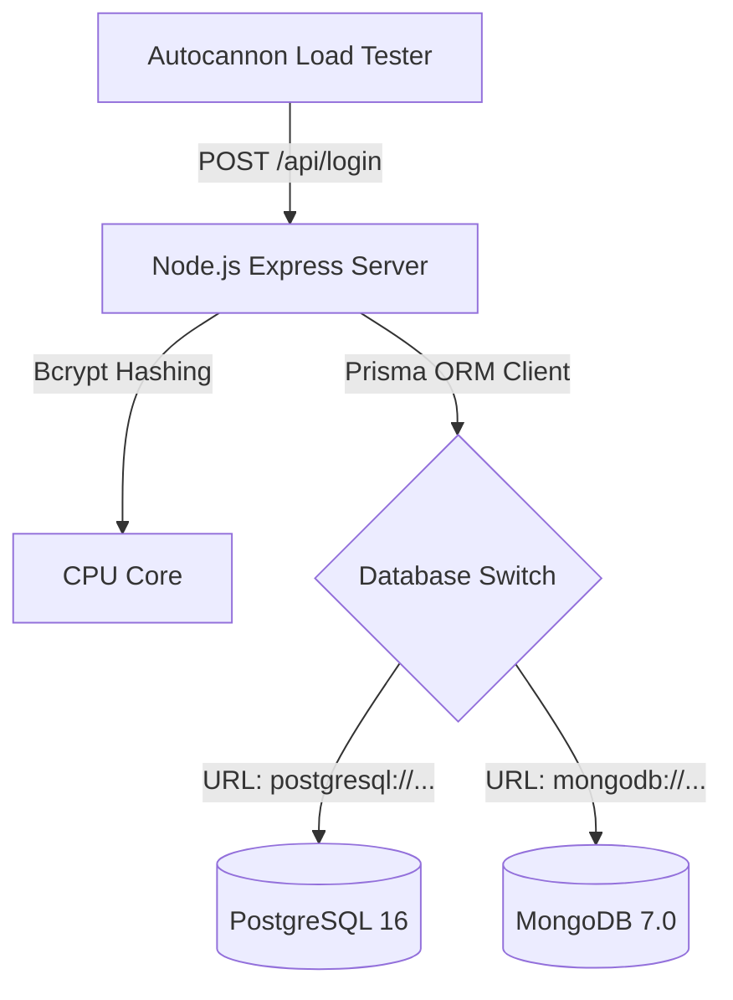

# Tahap 1: Arsitektur dan Skema Database

Dokumen ini memuat perancangan arsitektur data dan *Entity-Relationship* yang dipakai dalam uji komparasi.

## 1. Arsitektur Komponen

Eksperimen menggunakan topologi monolitik standar yang mengisolasi database agar *bottleneck* terlihat jelas:




## 2. Skema Data (Prisma)

Karena menggunakan ORM yang sama (Prisma), skema direpresentasikan dalam blok abstrak yang sama sebelum di-*generate* menjadi tipe relasional atau *document-based*.

```prisma
generator client {
  provider = "prisma-client-js"
}

datasource db {
  provider = "postgresql" // atau "mongodb"
  url      = env("DATABASE_URL")
}

model User {
  id        String   @id @default(uuid()) // Untuk MongoDB diganti menjadi @map("_id")
  email     String   @unique
  password  String
  createdAt DateTime @default(now())
}
```

## 3. Desain Eksperimental (Variabel)

- **Variabel Bebas (Independent):** Jenis Database (PostgreSQL vs MongoDB)
- **Variabel Terikat (Dependent):** Latency (Waktu respons API) dan Throughput (RPS).
- **Variabel Kontrol:**
  - Koneksi *Concurrent*: 500 koneksi
  - Durasi Uji: 30 Detik
  - Fungsi Hashing: Bcrypt (10 Salt Rounds)
  - Jumlah Data: 100.000 User Dummy (Faker.js)

---
*Status: Selesai diimplementasikan (lihat tahap 2).*
