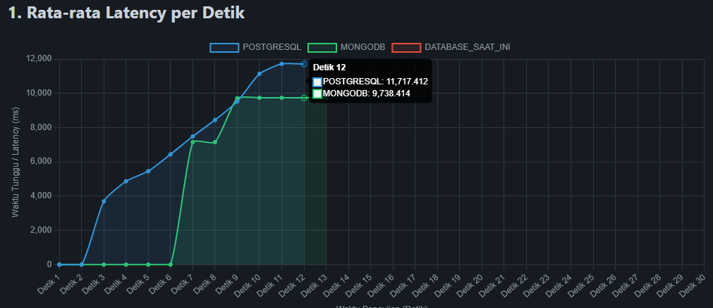
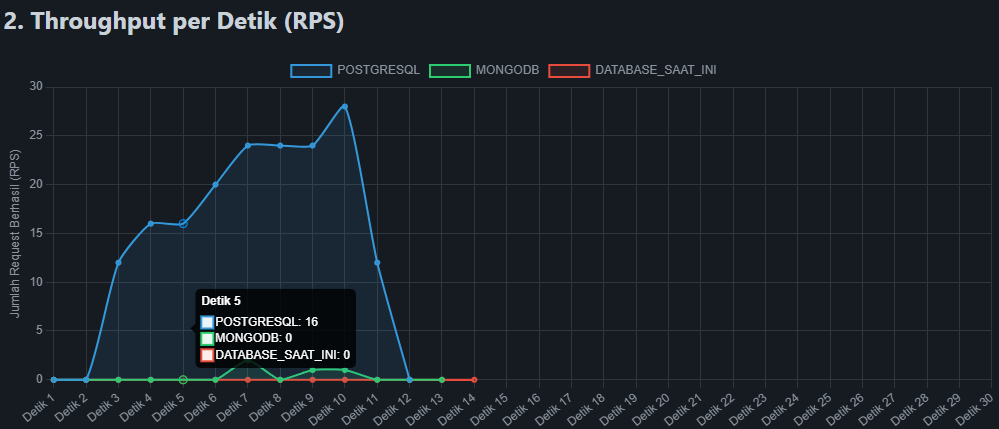

# 06 - Output

Direktori ini menampung keluaran analisis dari hasil eksperimen.

## Jenis Output

- Tabel *Descriptive Statistics* dan Analisis Kegagalan (*Failure Analysis*) performa DBMS di `tahap-4-analisis-data.md`.

output di sepenuhnya di simpan di: [../05-kode/praktikum/hasil_eksperimen.json](../05-kode/praktikum/hasil_eksperimen.json), dan `grafik_hasil.html`
- Laporan interpretasi anomali performa *thermal throttling*.

Keluaran selengkapnya dijelaskan di: [../09-docs/tahap-4-analisis-data.md](../09-docs/tahap-4-analisis-data.md).
